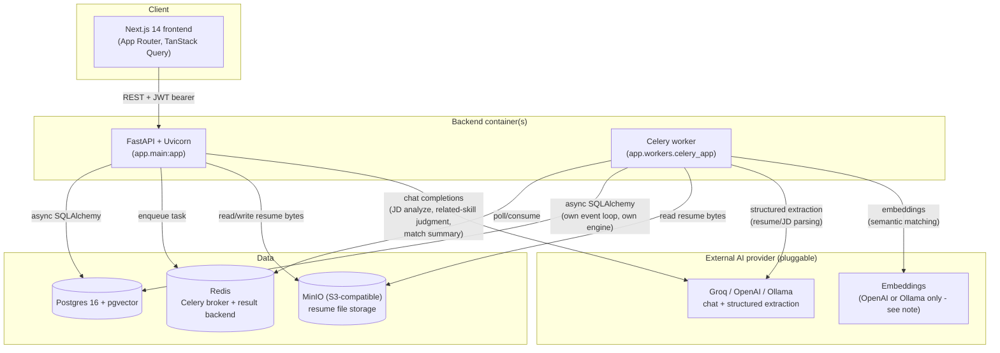
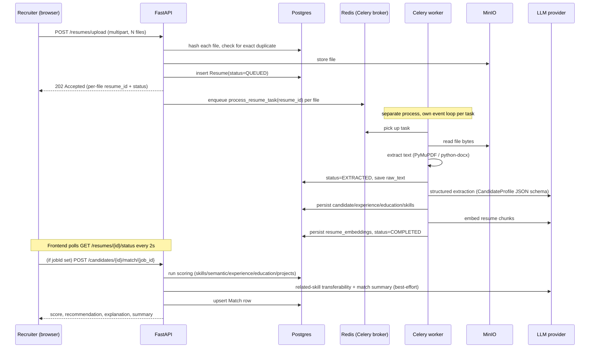

# Architecture

## System overview

**Why two compute roles (API + worker) sharing one image.** Resume
parsing → LLM extraction → embedding is too slow to run inside an HTTP
request, so `POST /resumes/upload` only validates, deduplicates by SHA-256,
stores the file, and enqueues a Celery task per file — the endpoint returns
in milliseconds regardless of batch size. `backend/Dockerfile` is one shared
image; `infra/docker-compose.yml` runs it twice with different `command:`s
(`uvicorn ...` vs `celery ... worker`), so there's one dependency set to
keep in sync, not two.

## Request flow: uploading a resume against a job

Every AI call in this path is **best-effort with a deterministic
fallback** — see "Graceful degradation" below and `docs/design-decisions.md`.

## Why matches don't compute themselves

A `Match` row only exists for a `(job, candidate)` pair once something
explicitly triggers it — there is no background job that scores every
candidate against every job on a timer or on every page view. Three
triggers exist:

1. Uploading a resume **from a specific job's page** auto-matches that one
   candidate against that one job once processing completes
   (`ResumeUploadModal` with a `jobId` prop).
2. Opening a candidate's detail page with `?job=<id>` in the URL runs one
   match on load.
3. `POST /jobs/{id}/recalculate` (surfaced in the UI as **"Match all
   candidates"** on the job detail page) scores every candidate in the
   organization against that one job — the bulk path for candidates that
   were uploaded generically (from `/candidates`) or against a different job.

This is deliberate (`rankings.py` docstring: "only recompute on demand...
never silently on every page view") — matching calls an LLM per related-skill
judgment and per match summary, so running it implicitly on every list
render would be slow and burn API quota for no reason. The tradeoff is the
one this repo's own "why is this job showing no candidates" investigation
surfaced: it's easy to upload resumes generically and forget that matching
is a separate, explicit step. The empty-state copy in the ranking table and
the "Match all candidates" button exist specifically to make that step
discoverable.

## Multi-tenancy

Single shared Postgres database, `organization_id` on every top-level row
(`jobs`, `candidates`, `users`), enforced in the **service layer** — every
query in `app/services/*.py` and `app/repositories/*.py` takes
`organization_id` from the authenticated JWT and filters by it explicitly.
See `docs/design-decisions.md` for why this was chosen over Postgres
row-level security.

## Graceful degradation

The AI-unavailable path: every place the app calls an LLM is wrapped to degrade instead of fail:

| Call | On LLM failure/unavailable |
|---|---|
| Resume/JD structured extraction | Resume still saves with `raw_text` and keyword-searchable; candidate profile fields stay empty rather than failing the whole upload |
| Semantic (embedding) score | Neutral `50/100`, and `match.reasoning.semantic` explains why, rather than treating "unknown" as "bad" |
| Related-skill transferability sentence | Omitted; the deterministic RELATED classification/score from `skill_matcher.py` (never LLM-derived) still stands |
| Match summary ("Why this candidate?") | Falls back to a deterministic template sentence built from the same computed facts |

This is why `match.model_name` can read `"none (AI unavailable)"` — that's
the system correctly reporting what happened, not a bug.

## Event-loop-per-task (a recurring constraint, not a one-off fix)

Celery tasks are synchronous entrypoints; each one wraps its work in a
fresh `asyncio.run(...)` (`app/workers/resume_tasks.py`,
`app/workers/matching_tasks.py`), which means **a new event loop per task**.
Two consequences that shaped the code:

- `app/db/worker_session.py` uses `NullPool` for the worker's DB engine —
  a pooled connection opened on one task's event loop breaks on the next
  task's (different) loop.
- LLM providers must be constructed **inside** the task via
  `build_llm_provider()` (uncached), not the FastAPI-only
  `get_llm_provider()` `@lru_cache` singleton — the singleton's
  `httpx.AsyncClient` is bound to whichever event loop first touched it,
  and every provider's `aclose()` is called in a `finally` block so the
  client doesn't leak across tasks either.

If you add a new Celery task that talks to Postgres or an LLM, follow
these two patterns — it's the single most common way to reintroduce
"Event loop is closed" errors in this codebase.

## Storage backend

Pluggable via `STORAGE_BACKEND` (`app/storage/factory.py`): `local` (disk,
`LOCAL_STORAGE_PATH`) for running the backend outside Docker, or `s3`
(MinIO in docker-compose, or real S3 in production) via `S3_*`/`AWS_*` env
vars. `infra/docker-compose.yml` always uses `s3` pointed at the bundled
MinIO container.

## Vector search tuning

`ivfflat` indexes (see `docs/database.md`) are approximate — recall trades
off against `lists`. `lists = 100` is a fixed dev-scale default; as
candidate volume grows, retune to roughly `rows / 1000` and `REINDEX` after
large bulk loads (ivfflat indexes are built from a snapshot, not maintained
incrementally the way a B-tree is).

## Frontend build mode

`frontend/Dockerfile` is a **production** multi-stage build
(`next build` → `output: standalone` → `node server.js`) with no volume
mount in `infra/docker-compose.yml` — editing a frontend file does **not**
hot-reload in the running container; rebuild with
`docker compose build frontend && docker compose up -d frontend` (or
`make build`). The **backend** service, by contrast, bind-mounts
`../backend:/app` and runs Uvicorn with `--reload`, so backend edits do
hot-reload. This asymmetry is intentional (a lean production image for the
thing users load directly) but easy to forget mid-development.
