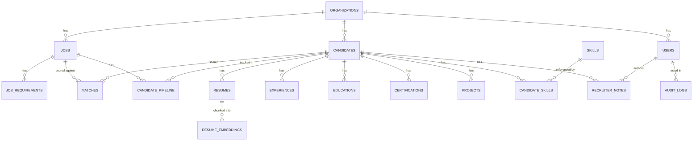

# Database schema & migrations

Postgres 16 with the [pgvector](https://github.com/pgvector/pgvector) extension
(`pgvector/pgvector:pg16` image — see `infra/docker-compose.yml`). Every table
is multi-tenant: `organizations` is the tenant root, and every other table
reaches it via `organization_id` (directly, or transitively through
`candidate_id`/`job_id`). All service-layer queries filter by
`current_user.organization_id` — see `docs/design-decisions.md` for why
row-level tenant scoping lives in the service layer rather than Postgres RLS.

## Entity overview



## Tables

Generated from live SQLAlchemy metadata (`app/db/base.py` + `app/models/*`) —
regenerate with the snippet at the bottom of this file if models change.

### `organizations` — tenant root
| Column | Type | Notes |
|---|---|---|
| id | UUID PK | |
| name | varchar(255) NOT NULL | |
| created_at | timestamp NOT NULL | |

### `users`
| Column | Type | Notes |
|---|---|---|
| id | UUID PK | |
| organization_id | UUID NOT NULL → `organizations.id` | indexed |
| email | varchar(255) NOT NULL | **unique** indexed |
| password_hash | varchar(255) NOT NULL | bcrypt |
| name | varchar(255) NOT NULL | |
| role | varchar NOT NULL | `ADMIN` \| `RECRUITER` \| `HIRING_MANAGER` |
| is_active | boolean NOT NULL | |
| created_at | timestamp NOT NULL | |

### `jobs`
| Column | Type | Notes |
|---|---|---|
| id | UUID PK | |
| organization_id | UUID NOT NULL → `organizations.id` | indexed |
| title | varchar(255) NOT NULL | |
| department, location, employment_type | varchar | |
| description | text NOT NULL | source for JD analysis + semantic embedding |
| seniority | varchar(50) | |
| responsibilities | jsonb | |
| min_experience_years, preferred_experience_years | float | |
| education_requirements | jsonb | list of `{degree_level, field, required}` |
| weight_skills / weight_semantic / weight_experience / weight_education / weight_projects | float NOT NULL | scoring weights, sum to 1.0 |
| status | varchar NOT NULL | `DRAFT` \| `ANALYZING` \| `ACTIVE` \| `ARCHIVED` |
| embedding | `vector(1536)` | job description embedding for semantic matching |
| created_at, updated_at | timestamp NOT NULL | |

### `job_requirements`
| Column | Type | Notes |
|---|---|---|
| id | UUID PK | |
| job_id | UUID NOT NULL → `jobs.id` | indexed |
| skill | varchar(255) NOT NULL | as entered/extracted |
| normalized_skill | varchar(255) NOT NULL | lowercased/canonicalized for matching, indexed |
| importance | float NOT NULL | 0–1 |
| required | boolean NOT NULL | required vs. preferred |
| minimum_years | float | |
| embedding | `vector(1536)` | |

### `candidates`
| Column | Type | Notes |
|---|---|---|
| id | UUID PK | |
| organization_id | UUID NOT NULL → `organizations.id` | indexed |
| name, email, phone, location | varchar | extracted from resume |
| email | varchar(255) | indexed (not unique — the same person can be re-uploaded under a new resume) |
| linkedin_url, github_url, portfolio_url | varchar(500) | |
| total_years_experience | float | |
| current_title, current_company | varchar(255) | |
| created_at, updated_at | timestamp NOT NULL | |

### `resumes`
| Column | Type | Notes |
|---|---|---|
| id | UUID PK | |
| candidate_id | UUID NOT NULL → `candidates.id` | indexed |
| file_name | varchar(500) NOT NULL | |
| file_hash | varchar(64) NOT NULL | SHA-256 of file bytes, indexed — exact-duplicate detection |
| storage_path | varchar(1000) NOT NULL | key in the storage backend (local disk or S3/MinIO) |
| mime_type | varchar(150) NOT NULL | |
| raw_text | text | cleaned extracted text; full-text-search-indexed (see below) |
| parsed_status | varchar NOT NULL | `QUEUED` → `PROCESSING` → `EXTRACTED` → `COMPLETED` (or `FAILED` / `DUPLICATE`) |
| processing_error | text | populated when `parsed_status = FAILED` |
| created_at | timestamp NOT NULL | |

### `resume_embeddings`
| Column | Type | Notes |
|---|---|---|
| id | UUID PK | |
| resume_id | UUID NOT NULL → `resumes.id` | indexed |
| chunk_text | text NOT NULL | |
| chunk_index | integer NOT NULL | order within the resume |
| embedding | `vector(1536)` NOT NULL | |

### `experiences`, `educations`, `certifications`, `projects`
All hang off `candidate_id → candidates.id` (indexed), populated by LLM
resume extraction (`app/extraction/resume_extractor.py`). `experiences` and
`projects` also carry an `embedding vector(1536)` for semantic matching
against job requirements.

| Table | Key columns |
|---|---|
| `experiences` | company, title, start_date, end_date, description, years, embedding |
| `educations` | institution, degree, field, start_year, end_year |
| `certifications` | name (NOT NULL), issuer, issue_date |
| `projects` | name (NOT NULL), description, technologies (jsonb), embedding |

### `skills` / `candidate_skills`
- `skills` is a **global, deduplicated** catalog: `normalized_name` is
  **unique**-indexed so "React.js", "ReactJS", "react" all resolve to one row.
- `candidate_skills` is the join table: `(candidate_id, skill_id)` composite
  PK, plus `proficiency`, `years_experience`, and `source`
  (`RESUME_EXTRACTION` \| `RECRUITER_ADDED` \| `INFERRED`).

### `matches` — persisted scoring result for one (job, candidate) pair
| Column | Type | Notes |
|---|---|---|
| id | UUID PK | |
| job_id | UUID NOT NULL → `jobs.id` | indexed |
| candidate_id | UUID NOT NULL → `candidates.id` | indexed |
| overall_score, skill_score, semantic_score, experience_score, education_score, certification_score, project_score | float NOT NULL | 0–100 each |
| matched_skills, missing_skills, partial_skills | jsonb NOT NULL | |
| strengths, improvements, interview_focus, evidence | jsonb NOT NULL | deterministic explanation output |
| recommendation | varchar NOT NULL | `STRONG_MATCH` \| `GOOD_MATCH` \| `MODERATE_MATCH` \| `NOT_SUITABLE` |
| reasoning | jsonb NOT NULL | per-component score narrative (incl. "semantic degraded to neutral 50" when AI was unavailable) |
| summary | text | LLM-generated "why this candidate" narrative, grounded in the fields above; falls back to a deterministic template sentence if the LLM is unavailable |
| model_name, embedding_model, prompt_version, scoring_version | varchar | attribution/audit trail — `"none (AI unavailable)"` when a run degraded |
| created_at | timestamp NOT NULL | |

There is no unique constraint enforced at the DB level on
`(job_id, candidate_id)` — the service layer (`matching_service.py`)
upserts by querying for an existing row first, so re-running a match
updates the same row rather than creating a duplicate.

### `candidate_pipeline`
Composite PK `(candidate_id, job_id)` — one recruiting-pipeline status per
candidate **per job** (the same person can be `SHORTLISTED` on one job and
`REJECTED` on another). `status`: `NEW` → `SCREENING` → `SHORTLISTED` →
`INTERVIEW` → `OFFER` → `HIRED` (or `REJECTED` at any point).

### `recruiter_notes`
Free-text notes a recruiter attaches to a candidate, attributed to
`user_id → users.id` (nullable — preserved if the user is later removed).

### `audit_logs`
Append-only action log: `action`, `resource_type`, `resource_id`,
`log_metadata` (jsonb), attributed to `user_id` (nullable). Written by
`app/services/audit_service.py` at key points (resume processed, etc.) —
not yet exhaustive across every mutation.

## Indexes beyond the obvious FK/unique ones

Two categories of index exist only as raw SQL in the migration
(`941a3a9195da_add_ivfflat_vector_similarity_indexes.py`) because pgvector's
`ivfflat` index type and Postgres's `to_tsvector` expression index aren't
expressible in SQLAlchemy's declarative model metadata — **this is expected**
and shows up as a false-positive "drop this index" in `alembic revision
--autogenerate` diffs; don't accept that suggestion.

- **Vector similarity** (`ivfflat`, cosine ops, `lists = 100`) on:
  `resume_embeddings.embedding`, `job_requirements.embedding`,
  `experiences.embedding`, `projects.embedding`, `jobs.embedding`.
  `lists = 100` is a coarse starting point for a small/dev-sized corpus.
  Rule of thumb for retuning as data grows: `lists ≈ rows / 1000`, and
  `ivfflat` indexes should be rebuilt (`REINDEX`) after large bulk loads
  since they're built from a snapshot of the data at creation time.
- **Full-text search**: `ix_resumes_raw_text_fts`, a GIN index on
  `to_tsvector('english', coalesce(raw_text, ''))`, backing keyword search
  in `app/api/v1/search.py` (combined with semantic/vector search for
  hybrid candidate search).

## Migrations

Alembic, 3 revisions to date, in `backend/alembic/versions/`:

| Revision | Summary |
|---|---|
| `957b5d0ee13f` | Initial schema — all 17 tables above. |
| `941a3a9195da` | Adds the 5 `ivfflat` vector indexes + the resume full-text-search GIN index (raw SQL, see above). |
| `9c62a622627b` | Adds `matches.summary` (LLM-generated match narrative). |

**Running migrations:**
```bash
make migrate                 # applies pending migrations inside the backend container
# or, without Docker:
cd backend && alembic upgrade head
```
The `backend` service in `infra/docker-compose.yml` also runs
`alembic upgrade head` automatically on every container start, before
starting Uvicorn — so `docker compose up` alone keeps the schema current.

**Creating a new migration** after changing a model in `app/models/`:
```bash
make migration msg="add foo column to bar"
# review the generated file under backend/alembic/versions/ before
# committing - autogenerate WILL propose dropping the ivfflat/FTS indexes
# above; delete those lines, they're not real drift.
```

## Known constraint: embedding dimensionality is fixed at 1536

Every `vector(...)` column is hard-coded to 1536 dimensions in the initial
migration, matching OpenAI's `text-embedding-3-small`. Switching
`EMBEDDING_MODEL`/`*_EMBEDDING_MODEL` to a model with a different output
dimensionality (e.g. a local Ollama embedding model) requires a **new
migration** to `ALTER COLUMN ... TYPE vector(N)` on every embedding column
— it will not adapt automatically, and mismatched dimensions fail at
insert time, not at startup. Groq itself provides no embedding endpoint
at all (see `docs/design-decisions.md`), so semantic scoring degrades
gracefully to a neutral score rather than erroring when only Groq is
configured.

## Regenerating the table dump above

```bash
cd backend
python -c "
import app.models  # noqa: registers all mapped classes
from app.db.base import Base
for name, table in sorted(Base.metadata.tables.items()):
    print(name, [c.name for c in table.columns])
"
```
